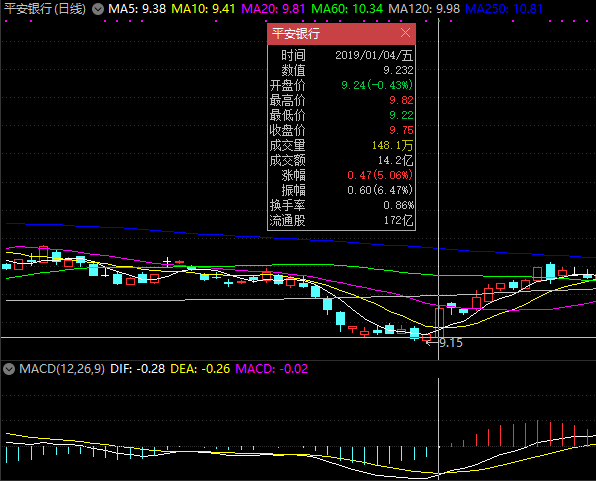

# MACD
指数平滑异同移动平均线(MACD)是股票交易中一种常见的技术分析工具, 用于研判股票价格变化的强度, 方向, 能量, 以及趋势周期, 以便把握股票买进和卖出的时机. MACD指标由一组曲线与图形组成, 通过收盘时股价或指数的快变及慢变的指数移动平均值(EMA)之间的差计算出来. "快"指更短时段的EMA, 而"慢"则指较长时段的EMA, 最常用的是12及26日EMA.

有关MACD的详细介绍请见[中文维基百科 MACD](https://zh.wikipedia.org/wiki/MACD).

一般地, 通过MACD图确定的买卖原则如下.

1. DIFF, DEA均为正, DIFF向上突破DEA, 买入信号参考.
2. DIFF, DEA均为负, DIFF向下跌破DEA, 卖出信号参考.
3. DIFF线与K线发生背离, 行情可能更出现反转信号.
4. DIFF, DEA的值从正数变成负数, 或者从负数变成正数并不是交易信号, 因为它们落后于市场.

其基本用法如下.

1. MACD金叉. DIFF由下向上突破DEA, 为买入信号.
2. MACD死叉. DIFF由上向下突破DEA, 为卖出信号.
3. MACD绿转红. MACD值由负变正, 市场由空头转为多头.
4. MACD红转绿. MACD由正变负, 市场多头转为空头.
5. DIFF与DEA均为正值, 大势属多头市场. DIFF向上突破DEA, 可作买入信号.
6. DIFF与DEA均为负值, 大势属空头市场. DIFF向下跌破DEA, 可作卖出信号.
7. 当DEA线与K线趋势发生背离时为反转信号.
8. DEA在盘整局面时失误率较高, 但如果配合RSA及KDJ指标可适当弥补缺点.

总的来说, MACD为红柱即做多, MACD为绿柱即做空.

如图是`平安银行 000001`的日K线图的一部分, 其中副图指标选择了MA和MACD.

以2019/01/07/一前部分的MACD图为例.

1. MACD绿柱趋势有所下降, 市场空头行情减弱. 

2. DIFF与DEA均为负值, DIFF向上突破DEA, MACD金叉, 于前一交易日2019/01/04/五构成买入信号.

若在2019/01/04/五/09:30以9.24买入`平安银行 000001`, 持有至2019/02/22/五/09:30(图中未给出, 在那时MACD红柱趋势有所下降, DIFF即将下穿DEA)以11.35卖出, 除去手续费的影响, 收益率可达到22.84%.

