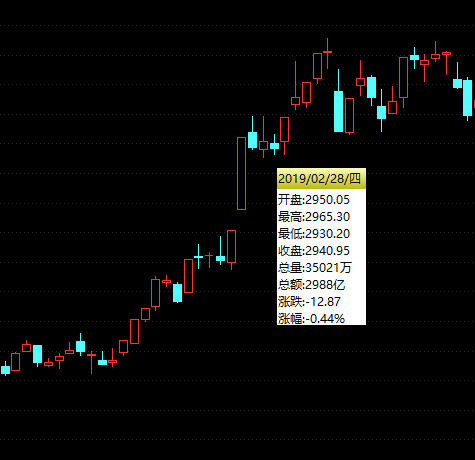

# K线
学会看K线图是每个初入股市新手学习的第一课.

如图是`上证指数 000001`的日K线图的一部分.

K线图每根线展示了当日的开盘价, 收盘价, 最高价, 最低价.

K线通常有一粗两细的三部分, 且细线只出现在粗线上部或下部. 可认为细线是蜡烛芯, 粗线是蜡烛, 蜡烛"穿过"蜡烛芯, 即细线中间"穿过"粗线.

细线的最上方表示当日最高价, 细线的最下方表示当日最低价.

用三种颜色表示当日收盘价与开盘价的高低关系(大于, 小于, 等于), 即阳线, 阴线, 中立线.

在中国地区习惯用红色表示收盘价高于开盘价, 用绿色表示收盘价低于开盘价.

若K线为红, 粗线的最上方表示当日收盘价, 粗线的最下方表示当日开盘价.

若K线为绿, 粗线的最上方表示当日开盘价, 粗线的最下方表示当日收盘价.

若开盘价或收盘价等于当日最高价, 则粗线上方无细线(细线最上方与粗线最上方重合).

若开盘价或收盘价等于当日最低价, 则粗线下方无细线(细线最下方与粗线最下方重合).

若开盘价等于收盘价, 则粗线为一字线.

K线只表示当日开盘价, 收盘价, 最高价, 最低价四项信息, 无法表示日涨幅.

K线与其前一K线结合可得日涨幅. 日涨幅 = (当日收盘价 - 前日收盘价) ÷ 前日收盘价 × 100%.

以图中2019/02/28/四的K线为例.

K线为绿线, 表示当日收盘价低于开盘价. 粗线最上方为开盘价2950.05, 粗线最下方为收盘价2940.95, 细线最下方为当日最低价2930.20, 细线最上方为当日最高价2965.30.
