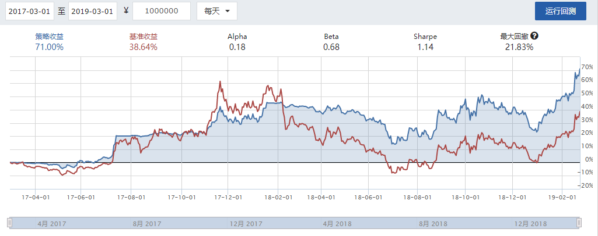

# 定投策略
定投, 即平均成本法(Dollar Cost Averaging, DCA), 是一种平均成本的策略. 即针对某资产定期投资一次, 以尽量规避大跌时带来的亏损的策略, 相应地也会减少大涨时带来的收益. 

详见[中文维基百科 平均成本法](https://zh.wikipedia.org/wiki/平均成本法).

我有过指数基金定投的经验, 加上看到2018年中国股市的"惨烈", 所以也想试一试股票定投.

每达到某特定条件(每隔固定时间股票涨幅在某值以下)时买入固定金额的某只股票, 直至全仓. 当达到预期收益后清仓. 待股票下跌至一定值后再次按上述策略买入.

# 在聚宽交易平台上制定简单的定投策略
针对`000001 平安银行`制定定投策略. 经过多次测试后我选择设置周涨幅上限为0.00%, 预定收益率为20.00%, 仓位分10档.

## 策略代码
```python
'''
简单的定投策略.
对于每个星期五的14:45, 若周涨幅不大于0.00%, 则加仓1/10;
对于每个交易日的14:45, 若收益率大于20.00%, 则清仓.
'''
def initialize(context):
    g.security = '000001.XSHE'
    set_benchmark('000001.XSHE')
    # 周涨幅上限
    g.change_limit = 0.0000
    # 预定收益率
    g.rate_of_return = 0.2000
    # 预定收益率更新时的乘数
    g.multiplier = 1 + g.rate_of_return
    
    # 开启动态复权模式(真实价格)
    set_option('use_real_price', True)

    ### 股票相关设定 ###
    # 股票类每笔交易时的手续费是：买入时佣金万分之三，卖出时佣金万分之三加千分之一印花税, 每笔交易佣金最低扣5块钱
    set_order_cost(OrderCost(close_tax=0.001, open_commission=0.0003, close_commission=0.0003, min_commission=5), type='stock')
    
    run_daily(trade, '14:45')

def trade(context):
    security = g.security
    # 累计出入金
    cash = context.portfolio.inout_cash
    if context.current_dt.isoweekday() == 5:
        # 获取收盘价
        close_data = attribute_history(security, 5, '1d', ['close'], df=False)
        # 取得周涨幅
        change = (close_data['close'][-1] - close_data['close'][0]) / close_data['close'][0]
        # 当周涨幅不高于周涨幅上限时, 加仓1/10
        if change <= g.change_limit:
            order_value(security, cash / 10)
            # 记录这次买入
            log.info("Buying %s" % (security))
            return
    # 累计收益
    returns = context.portfolio.returns
    # 取得当前持股数量
    amount = context.portfolio.positions[security].closeable_amount
    # 当达到预定收益率时, 清仓
    if returns >= g.rate_of_return:
        # 全仓卖出
        order_target(security, 0)
        # 记录这次卖出
        log.info("Selling %s" % (security))
        # 更新预定收益率, 因为累计收益是在本金的基础上变化的, 清仓后累计收益并不清零
        g.rate_of_return = (1 + returns) * g.multiplier - 1
        log.info("g.rate_of_return update: %f" % g.rate_of_return)
```
## 回测结果
初始资金为¥1000000, 回测时间为2017-03-01至2019-03-01.


策略收益为71.00%, 基准收益为38.64%, 说明在过去的两年针对`000001 中国平安`使用此策略会获得不小的收益. 但是这只是个例. 我并不看好此策略应用在其他股票或其他时间段上的收益情况.

如图所示, 在2017-07-13开始策略收益为平板走势, 说明进行了第一次清仓, 紧接着正好通过小仓位险些避开了2017-08-09开始的几日大跌. 但因接下来股票走势稍好, 也错过了几次加仓的机会, 从而从2017-11-07开始策略收益低于基准收益. 在2018-01-18收益率达到45.09%, 进行了第二次清仓, 从而又正好通过小仓位避开2018-02-06开始的几日大跌. 也正是因为这两次险避, 使得接下来的策略收益始终高于基准收益. 因为策略在这段时间始终为全仓, 所以仅当第三次清仓后股票出现大涨, 才有可能因为未及时加仓而使策略收益回落至基准收益以下.

综上所述, 我认为我这个策略的风险还是蛮大的.