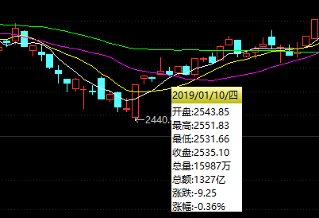

# 移动平均线
移动平均线, MA, 简称均线, 是技术分析中一种分析时间序列数据的工具. 最常见的是利用股价, 回报或交易量等变数计算出移动平均. 这里介绍简单移动平均.

n日均线值即当前交易日与其前(n - 1)个交易日的收盘价均值, 记作MAn. 若当日正在交易中, 则以现价作为当日价.

如图是`上证指数 999999`的K线图的一部分, 在其中加入了5日均线(MA5, 白色), 10日均线(MA10, 黄色), 20日均线(MA20, 粉色), 60日均线(MA60, 绿色).

可以看到, 短期均线MA5(白色)与K线图大致吻合, 而长期均线MA60(绿色)则较为偏离K线图. 这是因为短期均线的当日收盘价(即最新K线)的权重较大, 从而受较大影响.