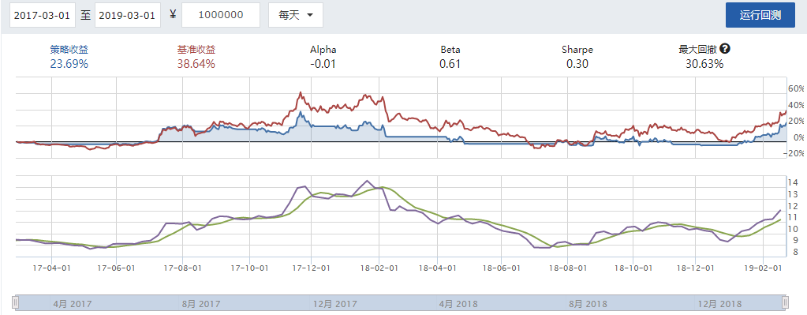

# 均线趋势策略
均线趋势策略, 又称双均线策略, 即当短期均线大于长期均线时看多, 否则看空.

具体操作为短期均线从下向上穿过长期均线则做多, 短期均线从上向下穿过长期均线则做空.

如图是`平安银行 000001`的K线图的一部分, 在其中加入了5日均线(MA5, 白色), 10日均线(MA10, 黄色), 20日均线(MA20, 粉色), 60日均线(MA60, 绿色), 120日均线(MA120, 灰色), 250日均线(MA250, 蓝色).


在2019/01/09/三, 短期均线MA5(白色)从下向上穿过长期均线MA20(粉色), 因此做多. 这便是使用均线趋势策略的一例.

# 在聚宽量化交易平台上制定简单的均线趋势策略
根据《量化交易术: 中低频量化交易策略研发》中使用均线趋势策略对`000300 沪深300指数`的回测实例, 针对`000001 平安银行`制定均线趋势策略.

## 策略代码
```python
'''
均线趋势策略. 当短期均线从下向上穿过长期均线时全仓, 否则清仓.
'''
def initialize(context):
    g.security = '000001.XSHE'
    set_benchmark('000001.XSHE')
    # True为开启动态复权模式，使用真实价格交易
    set_option('use_real_price', True) 
    # 设定成交量比例
    set_option('order_volume_ratio', 1)
    # 股票类交易手续费是：买入时佣金万分之三，卖出时佣金万分之三加千分之一印花税, 每笔交易佣金最低扣5块钱
    set_order_cost(OrderCost(open_tax=0, close_tax=0.001, open_commission=0.0003, close_commission=0.0003, close_today_commission=0, min_commission=5), type='stock')
    run_daily(trade, 'every_bar')

def trade(context):
    security = g.security
    # 设定均线窗口长度
    n_short = 3
    n_long = 21
    # 获取股票的收盘价
    close_data = attribute_history(security, n_long + 2, '1d', ['close'],df=False)
    # 取得过去n_short天的平均价格
    ma_n_short = close_data['close'][-n_short:].mean()
    # 取得过去n_long天的平均价格
    ma_n_long = close_data['close'][-n_long:].mean()
    # 累计出入金
    cash = context.portfolio.inout_cash
    # 取得当前持股数量
    amount = context.portfolio.positions[security].closeable_amount
    # 当短期均线从下向上穿过长期均线时买入
    if ma_n_short > ma_n_long:
        # 全仓
        order_value(security, cash)
        # 记录这次买入
        log.info("Buying %s" % (security))
    # 当短期均线从上向下穿过长期均线时卖出
    elif ma_n_short < ma_n_long and amount > 0:
        # 清仓
        order_target(security, 0)
        # 记录这次卖出
        log.info("Selling %s" % (security))
    # 绘制n_short日均线价格
    record(ma_n_short=ma_n_short)
    # 绘制n_long日均线价格
    record(ma_n_long=ma_n_long)
```
## 回测结果
初始资金为¥1000000, 回测时间为2017-03-01至2019-03-01.


策略收益为23.69%, 而基准收益(即`000001 平安银行`在期间内涨幅)为38.64%. 可见均线趋势策略虽然简单, 但并不是一个较好的策略.
# 参考文献

杨博理, 贾芳.量化炼金术: 中低频量化交易策略研发.北京: 机械工业出版社, 2017.8: 4.2 均线趋势策略的简单优化.