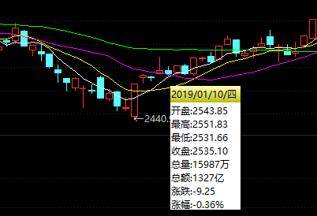
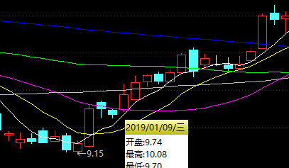
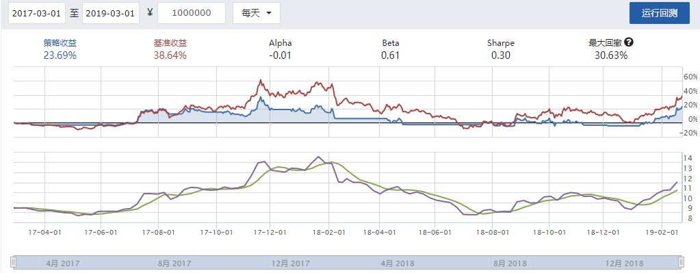

# 软件工程实训(高级) 学习笔记
# 中山大学数据科学与计算机学院 16340299 赵博然
# 2019/03/21 ~ 2019/04/11
## Python 3应用于量化交易策略的学习
我在此前从未接触过Python, 所以先学习了Python 3的基本语法, 以及NumPy, pandas等工具.

`pip install abupy`部署abupy量化环境.

## 参考文献
阿布.量化交易之路: 用Python做股票量化分析.北京: 机械工业出版社, 2017.7.

---
## K线
学会看K线图是每个初入股市新手学习的第一课.

如图是`上证指数 999999`的日K线图的一部分.


K线图每根线展示了当日的开盘价, 收盘价, 最高价, 最低价.

K线通常有一粗两细的三部分, 且细线只出现在粗线上部或下部. 可认为细线是蜡烛芯, 粗线是蜡烛, 蜡烛"穿过"蜡烛芯, 即粗线"穿过"细线.

细线的最上方表示当日最高价, 细线的最下方表示当日最低价.

用三种颜色表示当日收盘价与开盘价的高低关系(大于, 小于, 等于), 即阳线, 阴线, 中立线.

在中国地区习惯用红色表示收盘价高于开盘价, 用绿色表示收盘价低于开盘价.

若K线为红, 粗线的最上方表示当日收盘价, 粗线的最下方表示当日开盘价.

若K线为绿, 粗线的最上方表示当日开盘价, 粗线的最下方表示当日收盘价.

若开盘价或收盘价等于当日最高价, 则粗线上方无细线(细线最上方与粗线最上方重合).

若开盘价或收盘价等于当日最低价, 则粗线下方无细线(细线最下方与粗线最下方重合).

若开盘价等于收盘价, 则粗线为一字线.

K线只表示当日开盘价, 收盘价, 最高价, 最低价四项信息, 无法表示日涨幅.

K线与其前一K线结合可得日涨幅. 日涨幅 = (当日收盘价 - 前日收盘价) ÷ 前日收盘价 × 100%.

并不是当日K线为红就说明日涨幅为正, 当日K线为绿就说明日涨幅为负.

以图中2019/02/28/四的K线为例.

K线为绿线, 表示当日收盘价低于开盘价. 粗线最上方为开盘价2950.05, 粗线最下方为收盘价2940.95, 细线最下方为当日最低价2930.20, 细线最上方为当日最高价2965.30.

---
## 移动平均线
移动平均线, MA, 简称均线, 是技术分析中一种分析时间序列数据的工具. 最常见的是利用股价, 回报或交易量等变数计算出移动平均. 这里介绍简单移动平均.

n日均线值即当前交易日与其前(n - 1)个交易日的收盘价均值, 记作MAn. 若当日正在交易中, 则以现价作为当日价.

如图是`上证指数 999999`的K线图的一部分, 在其中加入了5日均线(MA5, 白色), 10日均线(MA10, 黄色), 20日均线(MA20, 粉色), 60日均线(MA60, 绿色).



可以看到, 短期均线MA5(白色)与K线图大致吻合, 而长期均线MA60(绿色)则较为偏离K线图. 这是因为短期均线的当日收盘价(即最新K线)的权重较大, 从而受较大影响.

---
## 均线趋势策略
均线趋势策略, 又称双均线策略, 即当短期均线大于长期均线时看多, 否则看空.

具体操作为短期均线从下向上穿过长期均线则做多, 短期均线从上向下穿过长期均线则做空.

如图是`平安银行 000001`的K线图的一部分, 在其中加入了5日均线(MA5, 白色), 10日均线(MA10, 黄色), 20日均线(MA20, 粉色), 60日均线(MA60, 绿色), 120日均线(MA120, 灰色), 250日均线(MA250, 蓝色).



在2019/01/09/三, 短期均线MA5(白色)从下向上穿过长期均线MA20(粉色), 因此做多. 这便是使用均线趋势策略的一例.

## 在聚宽量化交易平台上制定简单的均线趋势策略
根据《量化交易术: 中低频量化交易策略研发》中使用均线趋势策略对`000300 沪深300指数`的回测实例, 针对`000001 平安银行`制定均线趋势策略.

### 策略代码
```python
'''
均线趋势策略. 当短期均线从下向上穿过长期均线时全仓, 否则清仓.
'''
def initialize(context):
    g.security = '000001.XSHE'
    set_benchmark('000001.XSHE')
    # True为开启动态复权模式，使用真实价格交易
    set_option('use_real_price', True) 
    # 设定成交量比例
    set_option('order_volume_ratio', 1)
    # 股票类交易手续费是：买入时佣金万分之三，卖出时佣金万分之三加千分之一印花税, 每笔交易佣金最低扣5块钱
    set_order_cost(OrderCost(open_tax=0, close_tax=0.001, open_commission=0.0003, close_commission=0.0003, close_today_commission=0, min_commission=5), type='stock')
    run_daily(trade, 'every_bar')

def trade(context):
    security = g.security
    # 设定均线窗口长度
    n_short = 3
    n_long = 21
    # 获取股票的收盘价
    close_data = attribute_history(security, n_long + 2, '1d', ['close'],df=False)
    # 取得过去n_short天的平均价格
    ma_n_short = close_data['close'][-n_short:].mean()
    # 取得过去n_long天的平均价格
    ma_n_long = close_data['close'][-n_long:].mean()
    # 累计出入金
    cash = context.portfolio.inout_cash
    # 取得当前持股数量
    amount = context.portfolio.positions[security].closeable_amount
    # 当短期均线从下向上穿过长期均线时买入
    if ma_n_short > ma_n_long:
        # 全仓
        order_value(security, cash)
        # 记录这次买入
        log.info("Buying %s" % (security))
    # 当短期均线从上向下穿过长期均线时卖出
    elif ma_n_short < ma_n_long and amount > 0:
        # 清仓
        order_target(security, 0)
        # 记录这次卖出
        log.info("Selling %s" % (security))
    # 绘制n_short日均线价格
    record(ma_n_short=ma_n_short)
    # 绘制n_long日均线价格
    record(ma_n_long=ma_n_long)
```
### 回测结果
初始资金为¥1000000, 回测时间为2017-03-01至2019-03-01.


策略收益为23.69%, 而基准收益(即`000001 平安银行`在期间内涨幅)为38.64%. 可见均线趋势策略虽然简单, 但并不是一个较好的策略.
## 参考文献

杨博理, 贾芳.量化炼金术: 中低频量化交易策略研发.北京: 机械工业出版社, 2017.8: 4.2 均线趋势策略的简单优化.

---
## 定投策略
定投, 即平均成本法(Dollar Cost Averaging, DCA), 是一种平均成本的策略. 即针对某资产定期投资一次, 以尽量规避大跌时带来的亏损的策略, 相应地也会减少大涨时带来的收益. 

详见[中文维基百科 平均成本法](https://zh.wikipedia.org/wiki/平均成本法).

我有过指数基金定投的经验, 加上看到2018年中国股市的"惨烈", 所以也想试一试股票定投.

每达到某特定条件(每隔固定时间股票涨幅在某值以下)时买入固定金额的某只股票, 直至全仓. 当达到预期收益后清仓. 待股票下跌至一定值后再次按上述策略买入.

## 在聚宽交易平台上制定简单的定投策略
针对`000001 平安银行`制定定投策略. 经过多次测试后我选择设置周涨幅上限为0.00%, 预定收益率为20.00%, 仓位分10档.

### 策略代码
```python
'''
简单的定投策略.
对于每个星期五的14:45, 若周涨幅不大于0.00%, 则加仓1/10;
对于每个交易日的14:45, 若收益率大于20.00%, 则清仓.
'''
def initialize(context):
    g.security = '000001.XSHE'
    set_benchmark('000001.XSHE')
    # 周涨幅上限
    g.change_limit = 0.0000
    # 预定收益率
    g.rate_of_return = 0.2000
    # 预定收益率更新时的乘数
    g.multiplier = 1 + g.rate_of_return
    
    # 开启动态复权模式(真实价格)
    set_option('use_real_price', True)

    ### 股票相关设定 ###
    # 股票类每笔交易时的手续费是：买入时佣金万分之三，卖出时佣金万分之三加千分之一印花税, 每笔交易佣金最低扣5块钱
    set_order_cost(OrderCost(close_tax=0.001, open_commission=0.0003, close_commission=0.0003, min_commission=5), type='stock')
    
    run_daily(trade, '14:45')

def trade(context):
    security = g.security
    # 累计出入金
    cash = context.portfolio.inout_cash
    if context.current_dt.isoweekday() == 5:
        # 获取收盘价
        close_data = attribute_history(security, 5, '1d', ['close'], df=False)
        # 取得周涨幅
        change = (close_data['close'][-1] - close_data['close'][0]) / close_data['close'][0]
        # 当周涨幅不高于周涨幅上限时, 加仓1/10
        if change <= g.change_limit:
            order_value(security, cash / 10)
            # 记录这次买入
            log.info("Buying %s" % (security))
            return
    # 累计收益
    returns = context.portfolio.returns
    # 取得当前持股数量
    amount = context.portfolio.positions[security].closeable_amount
    # 当达到预定收益率时, 清仓
    if returns >= g.rate_of_return:
        # 全仓卖出
        order_target(security, 0)
        # 记录这次卖出
        log.info("Selling %s" % (security))
        # 更新预定收益率, 因为累计收益是在本金的基础上变化的, 清仓后累计收益并不清零
        g.rate_of_return = (1 + returns) * g.multiplier - 1
        log.info("g.rate_of_return update: %f" % g.rate_of_return)
```
### 回测结果
初始资金为¥1000000, 回测时间为2017-03-01至2019-03-01.


策略收益为71.00%, 基准收益为38.64%, 说明在过去的两年针对`000001 中国平安`使用此策略会获得不小的收益. 但是这只是个例. 我并不看好此策略应用在其他股票或其他时间段上的收益情况.

如图所示, 在2017-07-13开始策略收益为平板走势, 说明进行了第一次清仓, 紧接着正好通过小仓位险些避开了2017-08-09开始的几日大跌. 但因接下来股票走势稍好, 也错过了几次加仓的机会, 从而从2017-11-07开始策略收益低于基准收益. 在2018-01-18收益率达到45.09%, 进行了第二次清仓, 从而又正好通过小仓位避开2018-02-06开始的几日大跌. 也正是因为这两次险避, 使得接下来的策略收益始终高于基准收益. 因为策略在这段时间始终为全仓, 所以仅当第三次清仓后股票出现大涨, 才有可能因为未及时加仓而使策略收益回落至基准收益以下.

综上所述, 我认为我这个策略的风险还是蛮大的.
---
# 点评
### 主要注重两个指标, 收益率, 最大回撤.
### 熟悉股市.
### 熟悉其他基本的策略.
### 写选股策略.
### 熟悉聚宽交易平台. 有必要的话可以不用交易平台, 在本机上搭建自己的平台.
---