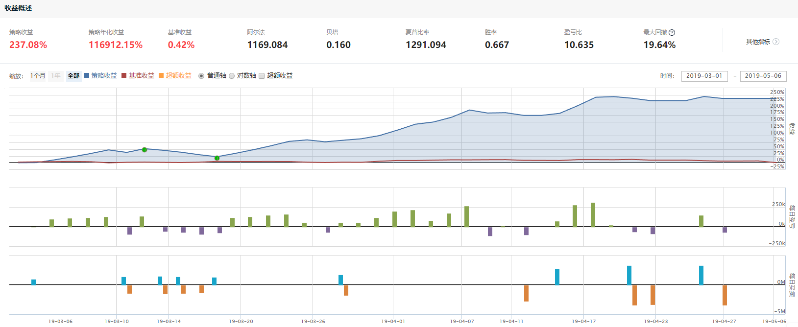
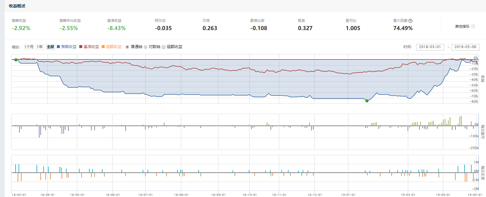

# 软件工程实训(高级) 报告
# 中山大学数据科学与计算机学院 16340299 赵博然
# 2019/04/11 ~ 2019/05/07
## 基于聚宽交易平台的选股

一些最基本的选股方法如下.

获取A股所有股票.
```python
def get_fullist():
    stocks = get_index_stocks('000002.XSHG') + get_index_stocks('399106.XSHE')
    stocks = [stock for stock in stocks if not stock.startswith('300')]
    return list(stocks)
```

剔除停牌股票.
```python
def filter_paused_stock(stock_list):
    current_data = get_current_data()
    return [stock for stock in stock_list if not current_data[stock].paused]
```

剔除退市股票.
```python
def delisted_filter(stock_list):
    current_data = get_current_data()
    stock_list = [stock for stock in stock_list if not '退' in current_data[stock].name]
    return stock_list
```

剔除被特别处理(ST)的股票.
```python
def st_filter(stock_list):
    current_data = get_current_data()
    stock_list = [stock for stock in stock_list if not current_data[stock].is_st]
    return stock_list
```

---
## 简单的选股策略

## 昨日涨停板块
昨日涨停板块收录了前个交易日中收盘价等于涨停价(日涨幅10%, ST股日涨幅5%)的股票. 该板块的成分股每天都在变化.

我观察到2019年2月小牛市以来, 在多数交易日, 昨日涨停板块中都有超过半数的股票继续上涨, 同时几乎每天都有连续涨停(连板)的股票. 当然不排除也有庄家出局而跌停的股票. 但通过这段时间的观察, 我认为在近期随机选择在近几日曾涨停的股票及时追涨并持有几天容易获利.

我在经过多次测试后, 决定的策略如下.

## 前日涨停昨日未涨停今日大涨追涨策略

1. 剔除A股中停牌, 退市, ST, 以及创业板(300开头)的股票.
2. 每个交易日开盘前, 选择前日涨停, 但昨日未涨停的全部股票作为股票池.
3. 买入. 09:35时从股票池中筛选所有涨幅不小于5%的股票, 并按涨幅降序排列. 依次全仓买入列表中的股票(多数情况每笔买入后都会有剩余资金, 也许足以买入列表中其他股票至少1手).
4. 卖出. 09:34时对于所有持仓股票, 若涨幅不大于0%, 则全仓卖出.
   
之所以选择09:34卖出, 09:35买入, 是由于A股的T+1交易制度, 即当天买入的股票无法卖出.

策略代码.
```python
# 导入函数库
from jqdata import *

def filter_paused_stock(stock_list):
    current_data = get_current_data()
    return [stock for stock in stock_list if not current_data[stock].paused]
    
def delisted_filter(stock_list):
    current_data = get_current_data()
    stock_list = [stock for stock in stock_list if not '退' in current_data[stock].name]
    return stock_list

def st_filter(stock_list):
    current_data = get_current_data()
    stock_list = [stock for stock in stock_list if not current_data[stock].is_st]
    return stock_list

# 筛选涨停股票
def high_limit_filter(stocks):
    ret = []

    cd = get_current_data()

    for stock in stocks:
        h = attribute_history(stock, 3, unit = '1d', fields = ('close', 'high_limit'), skip_paused = True)
        
        if (h.close[1] - h.close[0]) / h.close[0] > 0.095 and not (h.close[2] - h.close[1]) / h.close[1] > 0.095:
            ret.append(stock)

    return ret
    
def get_fullist():
    stocks = get_index_stocks('000002.XSHG') + get_index_stocks('399106.XSHE')
    stocks = [stock for stock in stocks if not stock.startswith('300')]
    return list(stocks)

# 初始化函数，设定基准等等
def initialize(context):
    g.stocks = get_fullist()
    g.stock = None
    g.last_price = 0.00
    # 设定沪深300作为基准
    set_benchmark('000300.XSHG')
    # 开启动态复权模式(真实价格)
    set_option('use_real_price', True)
    # 输出内容到日志 log.info()
    log.info('初始函数开始运行且全局只运行一次')
    # 过滤掉order系列API产生的比error级别低的log
    # log.set_level('order', 'error')

    ### 股票相关设定 ###
    # 股票类每笔交易时的手续费是：买入时佣金万分之三，卖出时佣金万分之三加千分之一印花税, 每笔交易佣金最低扣5块钱
    set_order_cost(OrderCost(close_tax=0.001, open_commission=0.0003, close_commission=0.0003, min_commission=5), type='stock')

    ## 运行函数（reference_security为运行时间的参考标的；传入的标的只做种类区分，因此传入'000300.XSHG'或'510300.XSHG'是一样的）
      # 开盘前运行
    run_daily(before_market_open, time='before_open', reference_security='000300.XSHG')
      # 开盘时运行
    run_daily(market_sell, time='09:34', reference_security='000300.XSHG')
    run_daily(market_buy, time='09:35', reference_security='000300.XSHG')
    #run_daily(before_market_close, time='14:45', reference_security='000300.XSHG')
      # 收盘后运行
    run_daily(after_market_close, time='after_close', reference_security='000300.XSHG')

## 开盘前运行函数
def before_market_open(context):
    # 输出运行时间
    log.info('函数运行时间(before_market_open)：'+ str(context.current_dt.time()))

    # 给微信发送消息（添加模拟交易，并绑定微信生效）
    # send_message('美好的一天~')
    g.stocks = get_fullist()
    g.stocks = filter_paused_stock(g.stocks)
    g.stocks = delisted_filter(g.stocks)
    g.stocks = st_filter(g.stocks)
    g.stocks = high_limit_filter(g.stocks)
    # 要操作的股票：平安银行（g.为全局变量）

def market_sell(context):
    current_data = get_current_data()
    for stock in context.portfolio.positions.keys():
        h = attribute_history(stock, 1, unit = '1d', fields = ('close'), skip_paused = True)
        last_close = h.close[0]
        current_price = current_data[stock].last_price
        cost = context.portfolio.positions[stock].avg_cost
        profit = (current_price - cost) / cost
        change = (current_price - last_close) / last_close
        init_time = context.portfolio.positions[stock].init_time
        if change <= 0.00:
            order_target(stock, 0)

## 开盘时运行函数
def market_buy(context):
    current_data = get_current_data()
    cash = context.portfolio.available_cash
    log.info(cash)
    log.info('函数运行时间(market_open):'+str(context.current_dt.time()))
    temp = {}
    for stock in g.stocks:
        h = attribute_history(stock, 1, unit = '1d', fields = ('close'), skip_paused = True)
        last_close = h.close[0]
        current_price = current_data[stock].last_price
        change = (current_price - last_close) / last_close
        if change >= 0.05 and current_price < current_data[stock].high_limit:
            temp[change] = stock
    temp = [temp[change] for change in sorted(temp.keys(), reverse = True)]
    for stock in temp:
        order_value(stock, cash / 1)

def before_market_close(context):
    current_data = get_current_data()
    log.info('函数运行时间(market_open):'+str(context.current_dt.time()))
    

## 收盘后运行函数
def after_market_close(context):
    log.info(str('函数运行时间(after_market_close):'+str(context.current_dt.time())))
    #得到当天所有成交记录
    trades = get_trades()
    for _trade in trades.values():
        log.info('成交记录：'+str(_trade))
    log.info('一天结束')
    log.info('##############################################################')

```

回测时间2019-03-01至2019-05-06, 资金为¥1000000. 回测结果如下.



我被这个结果惊住了. 短短两个月收益率达到了237.08%, 也许说明这个策略是一个赚钱效应极大的策略.

我认为这个策略的优点在于选择的股票会继续涨停的可能性很大, 从而成功追涨. 另一方面, 在4月下旬A股持续下跌的一段时间, 以及在5月6日千股跌停的一刻, 策略选择了退场观望, 避开了亏损.

但是我认为一个好的策略不可能就会这样简单诞生.

我把回测时间提前至2018-03-01, 再次回测.



可以发现, 这其实是一个极糟的策略. 或者说, 这个策略风险极大, 在2019年3月开始却有异常高的收益.

我认为这个策略之所以造成极大亏损是因为以下几点.
1. 追涨. 在买入股票时这只股票已经至少上涨5%, 即在今日无法卖出的剩余3小时55分钟, 只有不足5%的上涨空间和超过15%的下跌空间. 
2. 打板, 即追涨停. 打板通常是在与股市中的庄家博弈, 即把所有的资产都押给了庄家是否会继续加仓拉升股价直至涨停, 甚至连涨停板. 如果庄家在散户入场后撤走, 造成股价瞬间大跌甚至跌停, 连跌停板, 散户的亏损也许将不止15%.
3. 选股指标差. 这个策略只通过了近3个交易日的涨跌情况来筛选可能会继续大涨的股票, 而未通过其他基本指标例如成交量, 大单净量, 市盈率等进行筛选, 从而加大了风险.

---
# MACD
指数平滑异同移动平均线(MACD)是股票交易中一种常见的技术分析工具, 用于研判股票价格变化的强度, 方向, 能量, 以及趋势周期, 以便把握股票买进和卖出的时机. MACD指标由一组曲线与图形组成, 通过收盘时股价或指数的快变及慢变的指数移动平均值(EMA)之间的差计算出来. "快"指更短时段的EMA, 而"慢"则指较长时段的EMA, 最常用的是12及26日EMA.

有关MACD的详细介绍请见[中文维基百科 MACD](https://zh.wikipedia.org/wiki/MACD).

一般地, 通过MACD图确定的买卖原则如下.

1. DIFF, DEA均为正, DIFF向上突破DEA, 买入信号参考.
2. DIFF, DEA均为负, DIFF向下跌破DEA, 卖出信号参考.
3. DIFF线与K线发生背离, 行情可能更出现反转信号.
4. DIFF, DEA的值从正数变成负数, 或者从负数变成正数并不是交易信号, 因为它们落后于市场.

其基本用法如下.

1. MACD金叉. DIFF由下向上突破DEA, 为买入信号.
2. MACD死叉. DIFF由上向下突破DEA, 为卖出信号.
3. MACD绿转红. MACD值由负变正, 市场由空头转为多头.
4. MACD红转绿. MACD由正变负, 市场多头转为空头.
5. DIFF与DEA均为正值, 大势属多头市场. DIFF向上突破DEA, 可作买入信号.
6. DIFF与DEA均为负值, 大势属空头市场. DIFF向下跌破DEA, 可作卖出信号.
7. 当DEA线与K线趋势发生背离时为反转信号.
8. DEA在盘整局面时失误率较高, 但如果配合RSA及KDJ指标可适当弥补缺点.

总的来说, MACD为红柱即做多, MACD为绿柱即做空.

如图是`平安银行 000001`的日K线图的一部分, 其中副图指标选择了MA和MACD.


以2019/01/07/一前部分的MACD图为例.

1. MACD绿柱趋势有所下降, 市场空头行情减弱. 

2. DIFF与DEA均为负值, DIFF向上突破DEA, MACD金叉, 于前一交易日2019/01/04/五构成买入信号.

若在2019/01/04/五/09:30以9.24买入`平安银行 000001`, 持有至2019/02/22/五/09:30(图中未给出, 在那时MACD红柱趋势有所下降, DIFF即将下穿DEA)以11.35卖出, 除去手续费的影响, 收益率可达到22.84%.

---
# 点评
1. 学习3个基本指标: MACD, KDJ, BOLL.
2. 选择其中2个指标, 依据某种规则进行择时, 选股.
3. 在同一时间对所有股票通过上述规则进行"评分".
4. 上述指标有各自的参数. 对每只股票, 在不同时间段, 选择其各自的最优参数, 以求能较好通过指定规则反映其未来走势.